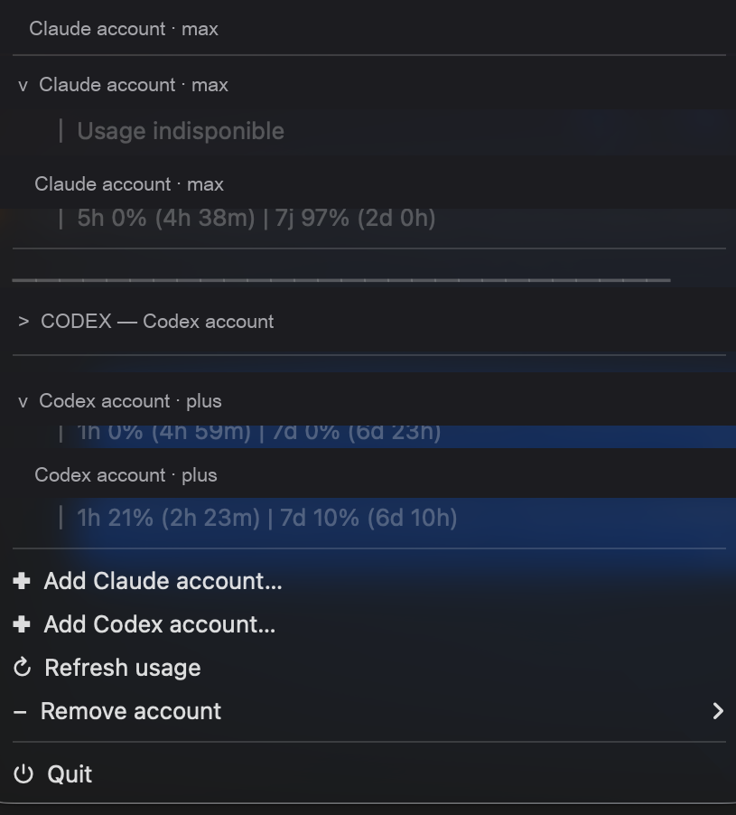

# agentic-cli-account-switcher

> Bash CLI to switch OAuth credentials between accounts for AI agentic CLIs on macOS. Handles both the credentials file AND the macOS Keychain — solves the silent overwrite that file-only switchers suffer when the CLI refreshes its OAuth token.

**Currently supported:** Claude Code (VS Code extension + native CLI), Codex CLI.
**Planned:** Gemini CLI, more.



---

## Why

Most existing Claude/Codex account switchers on GitHub only swap the credentials file (`~/.claude/.credentials.json` or `~/.codex/auth.json`). On macOS this is **not enough**. The CLIs also store OAuth tokens in the macOS Keychain (`security` service entries) and re-read them on session start or token refresh. A file-only swap can be silently undone within hours, leaking the wrong account's token back into your active session.

This script swaps **both** in a single atomic operation, with rollback on failure.

See [docs/keychain-caveat.md](docs/keychain-caveat.md) for the full technical explanation.

## Install

### One-liner (recommended)

```bash
curl -fsSL https://raw.githubusercontent.com/LARIkoz/agentic-cli-account-switcher/main/install.sh | bash
```

Installs `claude-switch` and `codex-switch` into `/usr/local/bin` if writable, otherwise `~/.local/bin`.

Environment overrides:

```bash
# Custom install dir
curl -fsSL https://raw.githubusercontent.com/LARIkoz/agentic-cli-account-switcher/main/install.sh | PREFIX=$HOME/bin bash

# Install only one of the two tools
curl -fsSL https://raw.githubusercontent.com/LARIkoz/agentic-cli-account-switcher/main/install.sh | TOOLS=claude bash

# Pin a specific tag/branch
curl -fsSL https://raw.githubusercontent.com/LARIkoz/agentic-cli-account-switcher/main/install.sh | REF=v0.1.0 bash
```

### Manual (git clone)

```bash
git clone https://github.com/LARIkoz/agentic-cli-account-switcher.git
cd agentic-cli-account-switcher
chmod +x bin/*.sh

# Optional: put on PATH
ln -s "$PWD/bin/claude-switch.sh" /usr/local/bin/claude-switch
ln -s "$PWD/bin/codex-switch.sh"  /usr/local/bin/codex-switch
```

Requirements: macOS, bash 3.2+, `security` CLI (built into macOS), `curl`, the AI tool you want to switch (Claude Code 2.x or Codex CLI).

## Usage — Claude Code

```bash
# One-time bootstrap: save your default account state
./bin/claude-switch.sh bootstrap

# Sign in to your second account (separate $HOME, default $HOME/.claude2)
CLAUDE_ACC2_HOME=$HOME/.claude2 claude --setup-token   # or use VS Code UI

# Switch to account 2 (also swaps Keychain entry)
./bin/claude-switch.sh acc2

# Show which account is active
./bin/claude-switch.sh status

# Switch back to default
./bin/claude-switch.sh default

# Fix a broken/half-swapped state
./bin/claude-switch.sh fix

# Smoke test: verify swap succeeded
./bin/claude-switch.sh smoke
```

Set `CLAUDE_ACC2_HOME` to override the secondary account's `$HOME` (default `$HOME/.claude2`).

## Usage — Codex CLI

```bash
# Switch between primary auth.json and auth_account1.json (and Codex App reload)
./bin/codex-switch.sh switch

# Restore the most recent backup
./bin/codex-switch.sh restore-last

# Show current account state
./bin/codex-switch.sh status

# Run preflight checks (lock state, app processes, file sanity)
./bin/codex-switch.sh preflight

# Account 2 specific helpers
./bin/codex-switch.sh acc2-status
./bin/codex-switch.sh acc2-smoke

# Repair a broken state
./bin/codex-switch.sh fix

# Skip auto-launch of Codex App after switch
./bin/codex-switch.sh switch --no-app

# Force switch even if Codex processes are still running (use with care)
./bin/codex-switch.sh switch --allow-running
```

## How it works

1. **File swap.** Move the live credentials file (`.credentials.json` / `auth.json`) into a per-account staging area and atomically rename the target account's file into place.
2. **Keychain swap.** Read the current Keychain entry into a per-account blob file (`security find-generic-password -gw`), then write the target account's blob back into the same Keychain service+account slot (`security add-generic-password -U`).
3. **Locking.** A `flock`-style directory lock prevents two concurrent switches from racing.
4. **Atomic rename chain.** All filesystem renames go through a tmp staging directory + single `mv`, so a crash mid-switch leaves either the old state or the new state — never a half state.
5. **Rollback.** On any failure mid-switch, every staged file is moved back to its original location.

See [docs/keychain-caveat.md](docs/keychain-caveat.md) for why the Keychain swap matters and how to detect that your CLI uses Keychain.

## Caveats

- **macOS only.** Linux and Windows do not have the macOS Keychain; a port would need an equivalent secure-store integration (`secret-tool` for Linux, Credential Manager for Windows). Not in v0.1.
- **OAuth refresh window.** Right after a successful switch the CLI may still hold the previous account's tokens in memory. For Claude Code that means reloading the VS Code window (Cmd+Shift+P → "Developer: Reload Window"). For Codex it means quitting and reopening Codex App (the `switch` command does this automatically unless you pass `--no-app`).
- **Don't run during active inference.** Switching mid-completion can confuse the CLI's session state. Quit pending CLI invocations before switching.
- **State directories.** Each script keeps backup blobs and lock state under `~/.claude/app-account-switch/` or `~/.codex/auth-switch-backups/`. These contain real OAuth tokens — protected by `chmod 700` but treat the directories like any other credential store.

## Alternatives

See [docs/alternatives.md](docs/alternatives.md) for a side-by-side comparison with Symbioose Claude Switcher, cux, claude-swap, ccs, and VDM.

TL;DR — use this repo if you want bash-only, scriptable, multi-CLI switching from the terminal. Use Symbioose if you want a polished menu bar GUI.

## Roadmap

- **v0.2** — Gemini CLI module (`bin/gemini-switch.sh`)
- **v0.3** — Linux Keychain via `secret-tool` / `libsecret`
- **v0.4** — Optional Homebrew tap
- **v0.5** — CI smoke tests

## Contributing

Pull requests welcome. Please:

- Test changes on at least one of the supported CLIs before submitting.
- Keep the bash 3.2 compatibility (macOS ships an old bash; don't use bash 4+ features).
- Don't include real account credentials, tokens, emails, or Keychain blobs in commits or screenshots.

## License

MIT — see [LICENSE](LICENSE).

## Credits

- Inspired by the architecture survey of [Symbioose/claude-account-switcher](https://github.com/Symbioose/claude-account-switcher), [realiti4/claude-swap](https://github.com/realiti4/claude-swap), [inulute/cux](https://github.com/inulute/cux), [kaitranntt/ccs](https://github.com/kaitranntt/ccs), and [loekj/claude-acct-switcher](https://github.com/loekj/claude-acct-switcher).
- The Keychain dual-swap discovery came from reverse-engineering Claude Code 2.1.x's native binary to confirm the Keychain service template `Claude Code${OAUTH_FILE_SUFFIX}${H}${K}`.
